# Backend Architecture

This document describes the current architecture of the **Social Media Autonomous Agents** backend: a FastAPI service that runs scheduled X (Twitter) posting for multiple accounts, persists state in RavenDB, and uses Claude for compose and safety checks.

**Related docs:** [ACCOUNT_SETUP.md](./ACCOUNT_SETUP.md) for provisioning accounts and credentials.

---

## 1. System overview

The backend is a single Python process that:

1. Serves a **read-mostly HTTP API** for a dashboard (accounts, status, pulled tweets).
2. Runs an in-process **APScheduler** for automated posting and engagement polling.
3. Stores per-account configuration and posting history in **RavenDB**.
4. Talks to **X API v2** (via Tweepy) and **Anthropic Claude** for generation and niche checks.

There is **no human review queue**. Reference tweets are fetched automatically, ranked, composed, safety-checked, and posted.

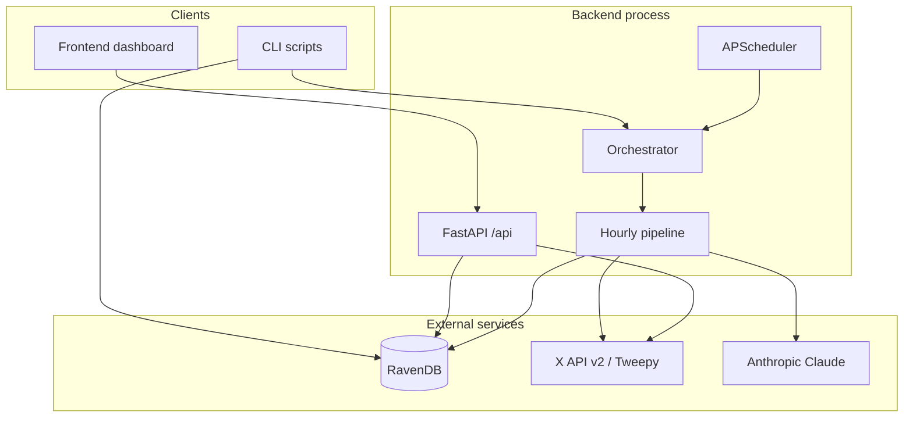

---

## 2. Layered architecture

Code is organized in layers. Dependencies generally flow **downward** (API and jobs call services; services call infrastructure and social clients).

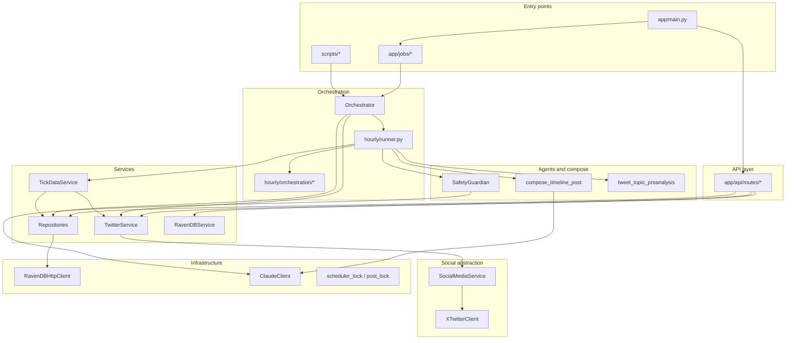

| Layer | Path | Responsibility |
|-------|------|----------------|
| Entry | `app/main.py`, `app/jobs/`, `scripts/` | Process bootstrap, HTTP, cron |
| API | `app/api/routes/` | REST endpoints for dashboard |
| Orchestration | `app/agents/orchestrator.py`, `app/hourly/` | Per-tick and per-account pipeline |
| Agents | `app/agents/`, `app/hourly/compose_timeline_post.py` | LLM compose and safety |
| Services | `app/services/` | Business logic, RavenDB access |
| Social | `app/social/` | Platform-agnostic facade; X implementation |
| Infrastructure | `app/infrastructure/` | RavenDB HTTP, Claude, file locks |
| Models | `app/models/` | Pydantic document shapes |
| Config | `app/core/config.py` | Environment-driven settings |

---

## 3. Process lifecycle and scheduler

On startup, FastAPI runs a **lifespan** hook that optionally starts APScheduler. Only one worker should hold the scheduler lock (`RUN_SCHEDULER=true`).

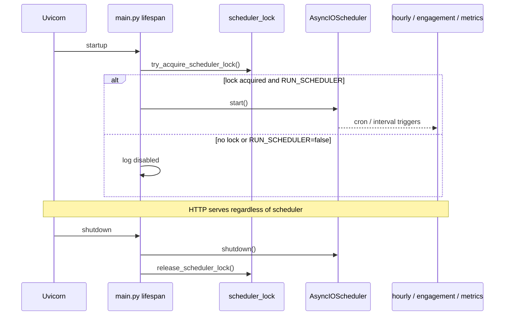

### Scheduled jobs

| Job ID | Callable | Schedule | Purpose |
|--------|----------|----------|---------|
| `scheduled_posting` | `run_hourly_job` | Every `POST_INTERVAL_MINUTES` (default 18), clock-aligned | Run posting tick for all active accounts |
| `engagement_poll` | `run_engagement_job` | `:05` each hour | Refresh metrics on tracked posts |
| `metrics_batch` | `run_metrics_job` | `:10` each hour | Placeholder / future batch metrics |

Posting is skipped when `HOURLY_POSTING_ENABLED=false` or during **quiet hours** (`post_quiet_hours_*` in `SCHEDULER_TIMEZONE`).

```mermaid
gantt
    title Example hour (POST_INTERVAL_MINUTES=18, UTC)
    dateFormat HH:mm
    axisFormat %H:%M

    section Posting
    Tick at :00     :00, 1m
    Tick at :18     :18, 1m
    Tick at :36     :36, 1m

    section Other jobs
    Engagement :05, 2m
    Metrics    :10, 2m
```

---

## 4. Component wiring

The **Orchestrator** is the composition root for automated posting. It constructs repositories, `TwitterService`, `TickDataService`, `SafetyGuardian`, and delegates to `run_hourly_tick`.

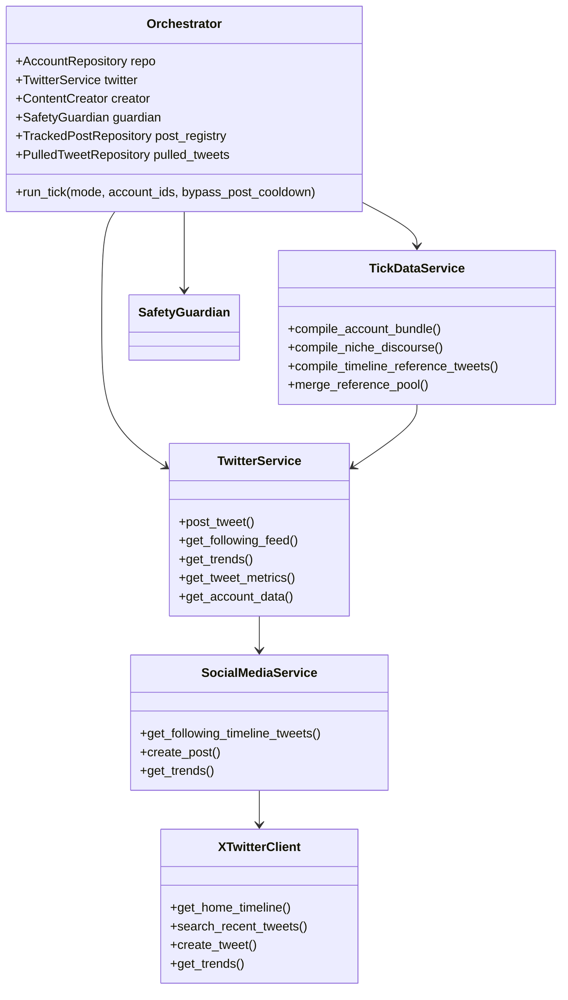

**Note:** `ContentCreator` is wired into `TickContext` but the **active** posting path uses `compose_formatted_post` directly, not the CrewAI `hourly_crew` pipeline.

---

## 5. Data layer (RavenDB)

Persistence uses **RavenDB** over HTTP (`RavenDBHttpClient`). Database name defaults to `SocialMediaSwarm`.

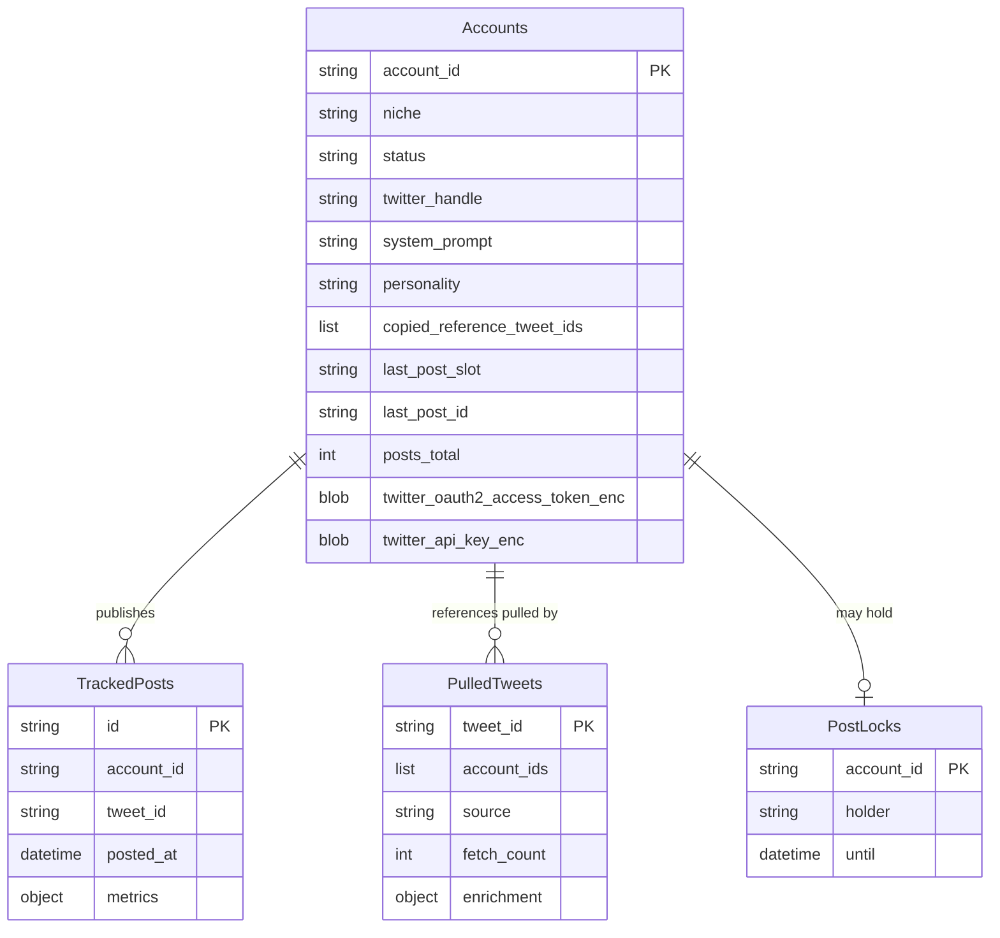

### Document ID conventions

| Collection | ID pattern | Repository |
|------------|------------|------------|
| `Accounts` | `accounts/{account_id}` | `AccountRepository` |
| `TrackedPosts` | `trackedposts/{account_id}-{tweet_id}` | `TrackedPostRepository` |
| `PulledTweets` | `pulledtweets/{tweet_id}` | `PulledTweetRepository` |
| `PostLocks` | `post-locks/{account_id}` | `PostLockRepository` |

### Credential storage

Per-account X tokens are stored **encrypted** (Fernet) on `AccountDocument`:

- **OAuth 2.0 user** (preferred): `twitter_oauth2_access_token_enc`, optional refresh token.
- **OAuth 1.0a**: consumer key/secret + access token/secret (four encrypted fields).

`TwitterService._x_credentials()` decrypts with `ENCRYPTION_KEY`. OAuth2 wins when present and decryptable.

---

## 6. X (Twitter) integration

All live X traffic goes through a thin stack. There is **no scraping**; only official API via Tweepy.

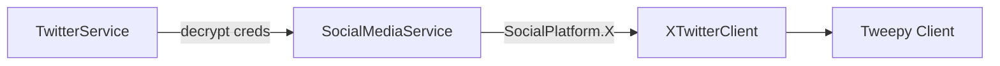

### Endpoints used (by feature)

| Feature | Tweepy / X API | Called from |
|---------|----------------|-------------|
| Following timeline (reference tweets) | `get_home_timeline` | `get_following_timeline_tweets` → `TickDataService.compile_timeline_reference_tweets` |
| Post publish | `create_tweet` | `finalize_post` → `TwitterService.post_tweet` |
| Tweet metrics | `get_tweet` | Engagement job, post-registry priming |
| Account profile | `get_me` / `get_user` | `compile_account_bundle`, health checks |
| Trends | v1.1 `get_place_trends` (OAuth1) or v2 `/2/trends/by/woeid/{id}` / personalized (OAuth2) | `compile_niche_discourse` (crew tools); **not** main posting path |
| Recent search | `search_recent_tweets` | Implemented; gated by `TREND_TWEET_SEARCH_ENABLED` (default **off**, not wired into posting runner) |

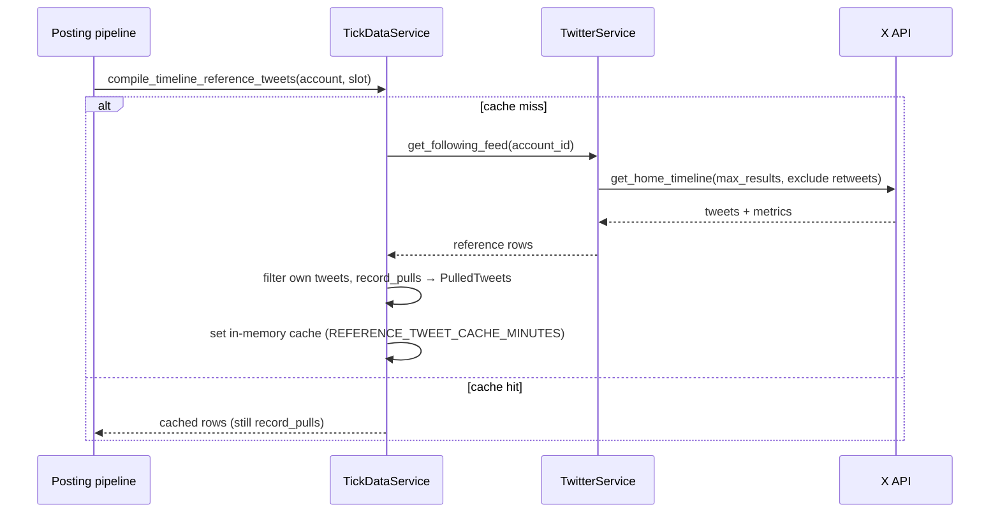

---

## 7. Posting pipeline (primary flow)

The production path is **timeline reference → compose → safety → publish**. One successful post per account per tick (when guards allow).

### 7.1 Tick-level flow

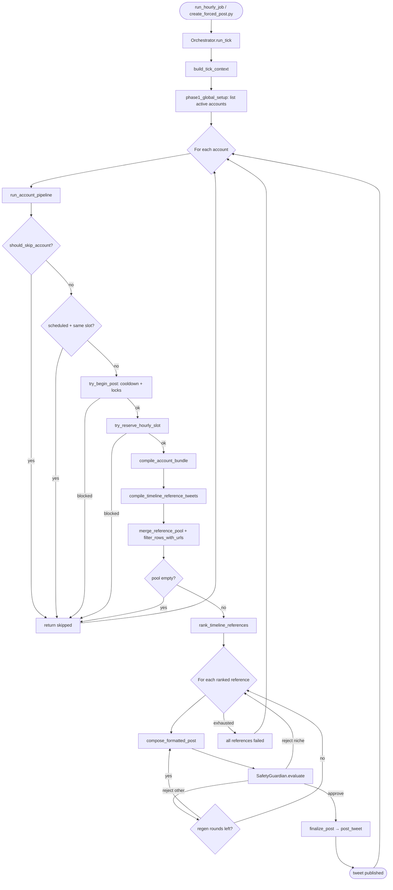

### 7.2 Guards and idempotency

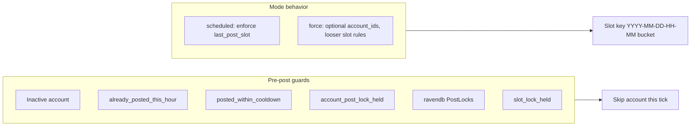

**Slot key** (`AccountRepository.current_post_slot_key()`): time bucket derived from `POST_INTERVAL_MINUTES` and `SCHEDULER_TIMEZONE`.

### 7.3 Compose and safety

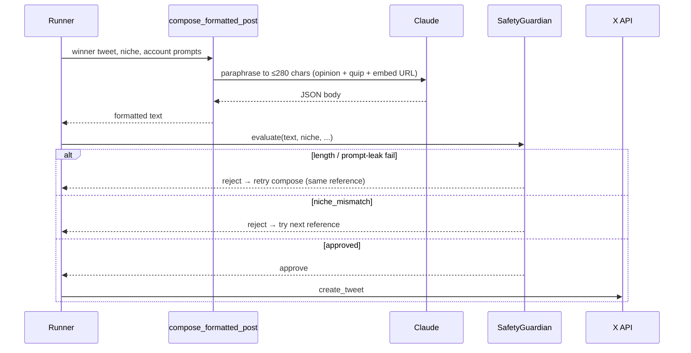

Prompts live under `app/hourly_crew/prompts/tasks/` (e.g. `compose_timeline_post.*.md`, `niche_fit_check.*.md`) and are loaded via `prompt_loader`.

### 7.4 Publish and side effects

On success, `finalize_post` (`hourly/orchestration/post_tick.py`):

1. `TwitterService.post_tweet`
2. Updates `AccountDocument` (`last_post_*`, `posts_total`, `copied_reference_tweet_ids`)
3. `TrackedPostRepository.record_post` + optional immediate metrics/enrichment
4. Releases slot reservation and post guard

---

## 8. Reference tweet ingestion

Reference tweets are **not** human-reviewed. They are pulled from the account’s **following home timeline**.

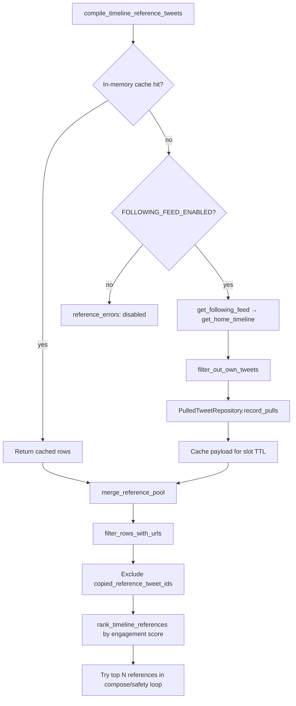

**Ranking** (`tweet_topic_preanalysis.rank_timeline_references`): weighted likes, replies, retweets, impressions; skips already-copied source tweet IDs.

---

## 9. Engagement polling

Separate from posting: refreshes metrics for tweets the system already published.

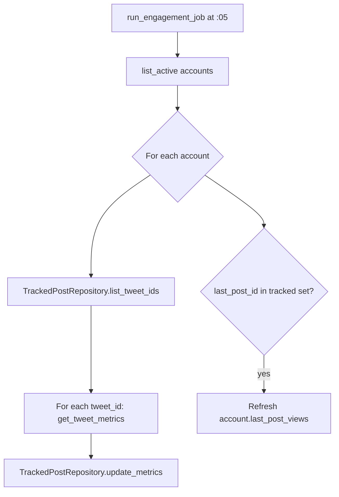

---

## 10. HTTP API surface

Routers are mounted under `/api` in `app/main.py`. CORS allows local frontend origins.

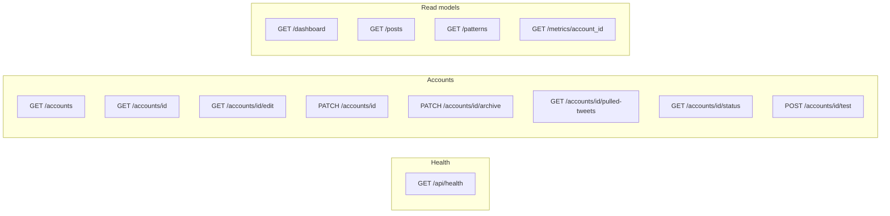

| Endpoint | Behavior |
|----------|----------|
| `GET /accounts` | List accounts (secrets redacted via `RavenDBService`) |
| `PATCH /accounts/{id}` | Update niche, personality, prompts (`AccountUpdateService`) |
| `GET /pulled-tweets` | Historical reference pulls from RavenDB (not live X pull) |
| `POST /test` | Live test post via `TwitterService.post_tweet` |
| `GET /dashboard` | Aggregate counts for UI |

**Account creation is not exposed over HTTP.** Use CLI: `scripts/add_account.py` or `account_setup_wizard.py`.

---

## 11. Configuration

Settings are loaded from `.env` via `app/core/config.py` (`pydantic-settings`).

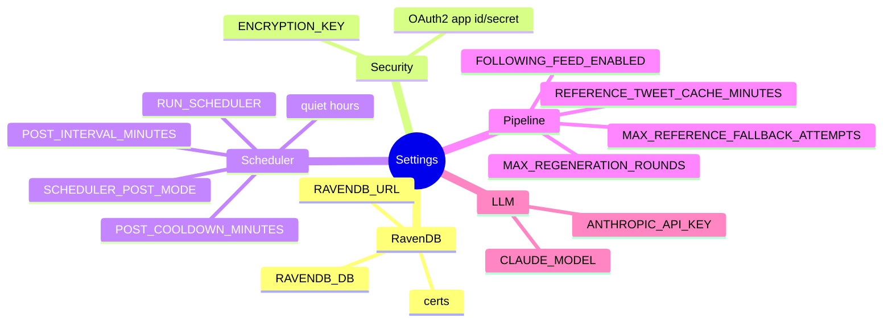

See `.env.example` for the full list.

---

## 12. CLI and manual entry points

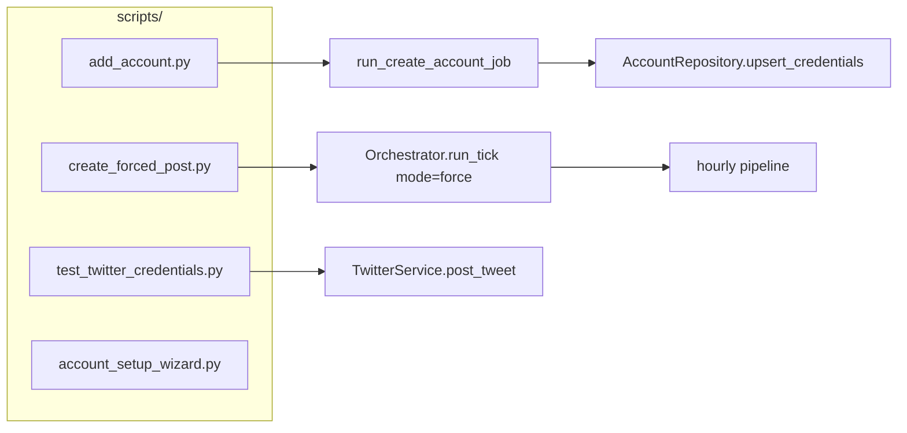

| Script | Purpose |
|--------|---------|
| `add_account.py` | Create account + encrypt credentials in RavenDB |
| `create_forced_post.py` | Run one posting tick (bypasses some slot rules) |
| `test_twitter_credentials.py` | Verify X connectivity per account |

---

## 13. Legacy and alternate paths

Two compose architectures exist; only one is used by `hourly/runner.py` today.

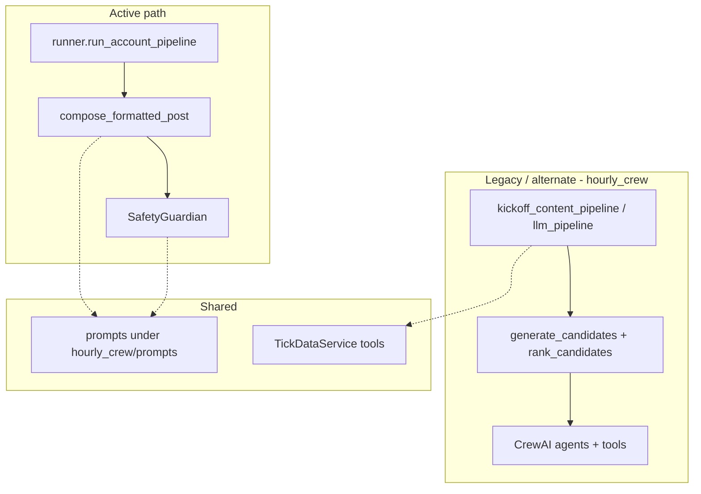

| Path | Status |
|------|--------|
| Timeline compose + `SafetyGuardian` | **Production** |
| `hourly_crew` CrewAI generate/rank | Implemented, **not** called from `run_account_pipeline` |
| Trend search for references | `search_recent_tweets` implemented; `TREND_TWEET_SEARCH_ENABLED=false`, not in runner |
| Buffer API | Optional scripts only; core pipeline posts via Tweepy |

---

## 14. Directory reference

```
backend/
├── app/
│   ├── main.py                 # FastAPI + APScheduler lifespan
│   ├── api/routes/             # REST handlers
│   ├── agents/                 # Orchestrator, SafetyGuardian, ContentCreator
│   ├── core/config.py          # Settings
│   ├── hourly/                 # Posting tick (runner, compose, orchestration)
│   ├── hourly_crew/            # Prompts, CrewAI, LLM tools (shared + legacy)
│   ├── infrastructure/         # RavenDB HTTP, Claude, locks
│   ├── jobs/                   # Scheduler callables
│   ├── models/                 # Pydantic documents
│   ├── services/               # Repositories, TwitterService, TickDataService
│   ├── social/                 # X client, DTOs, enrichment
│   └── utils/                  # encryption
├── scripts/                    # CLI entry points
├── tests/                      # unit + integration
└── docs/
    ├── ARCHITECTURE.md         # this file
    └── ACCOUNT_SETUP.md
```

---

## 15. Operational notes

- **Single scheduler:** File lock `%TEMP%/sma_apscheduler.lock` prevents duplicate cron in multi-worker deployments; set `RUN_SCHEDULER=false` on extra workers.
- **Tests:** X client and service layers are covered with **mocked Tweepy**; passing tests do not prove live API tier/access.
- **Observability:** Set `TICK_PIPELINE_TRACE=true` for structured step logs between pipeline phases (`pipeline_trace.trace_step`).

---

*Last updated to reflect the codebase as of the automated posting pipeline (timeline references, `compose_formatted_post`, APScheduler, RavenDB collections above).*
