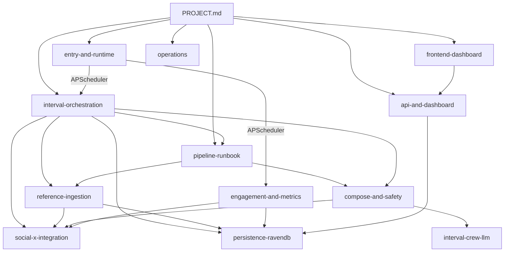

# Social Media Autonomous Agents

Canonical documentation entry point for **what the codebase does today**. Subsystem docs under [`subsystems/`](subsystems/) describe each layer in detail.

## What this project is

A FastAPI backend with an in-process APScheduler autonomously posts plain-text tweets to **X (Twitter)** for multiple niche accounts stored in **RavenDB**. Each posting tick loads active accounts, pulls tweets from the account's **following home timeline** (and optional X search queries) as reference material, ranks them, composes an opinion + quip + source link via **Claude** (or deterministic fallback), runs safety and niche-fit checks, posts to X, and records the tweet for engagement polling. There is **no human review queue**. A React **analytics dashboard** (React Router + TanStack Query) reads fleet, post, pipeline, and voice data from the API; account **creation** remains CLI-only ([ACCOUNT_SETUP](../SocialMediaAutonomousAgents/backend/docs/ACCOUNT_SETUP.md)).

## Repo layout

| Path | Contents |
|------|----------|
| `SocialMediaAutonomousAgents/backend/` | FastAPI app, jobs, interval pipeline, social layer, RavenDB repos |
| `SocialMediaAutonomousAgents/frontend/` | React (CRA) operator dashboard |
| `SocialMediaAutonomousAgents/docker-compose.yml` | Backend + frontend containers |
| `SocialMediaAutonomousAgents/scripts/` | Host PowerShell helpers (docker up, forced post) |
| `docs/` | This documentation tree (canonical) |

## Subsystem index

| Doc | Covers | Key entry files |
|-----|--------|-----------------|
| [entry-and-runtime](subsystems/entry-and-runtime.md) | Process startup, APScheduler, Docker | `backend/app/main.py`, `backend/app/jobs/*.py` |
| [interval-orchestration](subsystems/interval-orchestration.md) | Tick gateway, guards, slot idempotency | `backend/app/interval/runner.py`, `backend/app/agents/orchestrator.py` |
| [pipeline-runbook](subsystems/pipeline-runbook.md) | Tools catalog, typed reference-analysis runbook | `backend/app/pipeline/` |
| [reference-ingestion](subsystems/reference-ingestion.md) | Timeline fetch, rank, cache, dedup | `backend/app/services/tick_data_service.py` |
| [compose-and-safety](subsystems/compose-and-safety.md) | LLM compose, length budget, safety | `backend/app/interval/compose_timeline_post.py` |
| [interval-crew-llm](subsystems/interval-crew-llm.md) | Prompts, Claude client, alternate generate/rank | `backend/app/interval_crew/`, `backend/app/infrastructure/claude_client.py` |
| [social-x-integration](subsystems/social-x-integration.md) | Tweepy X client, OAuth1/2 | `backend/app/social/implementations/x_client.py` |
| [persistence-ravendb](subsystems/persistence-ravendb.md) | Documents, repos, encryption | `backend/app/infrastructure/ravendb_http.py` |
| [engagement-and-metrics](subsystems/engagement-and-metrics.md) | `:05` poll job, metrics placeholder | `backend/app/jobs/engagement_job.py` |
| [api-and-dashboard](subsystems/api-and-dashboard.md) | FastAPI routes | `backend/app/api/routes/` |
| [frontend-dashboard](subsystems/frontend-dashboard.md) | React analytics UI (fleet, posts, pipeline, voice) | `frontend/src/app/routes.tsx`, `frontend/src/features/` |
| [operations](subsystems/operations.md) | Docker, env, CLI scripts | `docker-compose.yml`, `backend/scripts/` |

Paths above are relative to `SocialMediaAutonomousAgents/`.

**Operational how-to:** [ACCOUNT_SETUP](../SocialMediaAutonomousAgents/backend/docs/ACCOUNT_SETUP.md) — provisioning accounts and credentials.

## How subsystems connect

**Control flow for a scheduled post:**

1. **entry-and-runtime** — APScheduler fires `interval_job` (respects quiet hours)
2. **interval-orchestration** — loads accounts, applies guards, reserves slot
3. **reference-ingestion** — fetches timeline (and optional search) via **social-x-integration**, caches, records PulledTweets
4. **pipeline-runbook** (reference phase) — typed runbook in `reference_phase.py`: parallel fetch → merge → own-post history → parallel rank/brief chains → pattern summaries in context artifacts (see [pipeline-runbook](subsystems/pipeline-runbook.md))
5. **compose-and-safety** — Claude compose with `reference_context_block` from analysis briefs; safety/niche checks
6. **interval-orchestration** — posts via **social-x-integration**, persists to **persistence-ravendb**
7. **engagement-and-metrics** — later polls views/likes on tracked posts

## Suggested reading paths

| Goal | Read first | Then |
|------|------------|------|
| New contributor | This doc → [entry-and-runtime](subsystems/entry-and-runtime.md) | [interval-orchestration](subsystems/interval-orchestration.md) → [pipeline-runbook](subsystems/pipeline-runbook.md) → [reference-ingestion](subsystems/reference-ingestion.md) → [compose-and-safety](subsystems/compose-and-safety.md) |
| Run the stack | [operations](subsystems/operations.md) | [backend/README](../SocialMediaAutonomousAgents/backend/README.md) |
| Add an account | [ACCOUNT_SETUP](../SocialMediaAutonomousAgents/backend/docs/ACCOUNT_SETUP.md) | [persistence-ravendb](subsystems/persistence-ravendb.md) |
| Debug a failed post | [interval-orchestration](subsystems/interval-orchestration.md) (skip reasons) | Enable `TICK_PIPELINE_TRACE=true` → [compose-and-safety](subsystems/compose-and-safety.md) |
| Dashboard behavior | [frontend-dashboard](subsystems/frontend-dashboard.md) | [api-and-dashboard](subsystems/api-and-dashboard.md) |
| X API / credentials | [social-x-integration](subsystems/social-x-integration.md) | [ACCOUNT_SETUP](../SocialMediaAutonomousAgents/backend/docs/ACCOUNT_SETUP.md) |

## Out of scope / not yet built

Verified from current code:

| Area | Status |
|------|--------|
| Human review queue before posting | Not implemented |
| `POST /api/accounts` for creation | Implemented (`PATCH` for updates) |
| Analytics API (`/api/accounts/{id}/tracked-posts`, pipeline outcomes, etc.) | Implemented — see [api-and-dashboard](subsystems/api-and-dashboard.md) |
| `GET /api/posts` | Fleet tracked-post rollup across active accounts |
| Dashboard `/api/dashboard` `avg_engagement` | Still `0.0` placeholder; per-post metrics on tracked posts and account-metrics doc |
| Metrics job (`:10`) | Placeholder — does not populate dashboard aggregate |
| Alternate generate→rank pipeline (`interval_crew/runner.py`) | Implemented but **not** wired into live tick |
| X recent search as reference source | Implemented when `TREND_TWEET_SEARCH_ENABLED=true` + per-account `search_queries` |
| Force-post SSE step ids vs runbook step ids | Not aligned — coarse progress in `force_post_progress.py` |
| Buffer posting integration | Config + sync scripts exist; live tick posts directly to X |
| Frontend live polling | `REACT_APP_POLLING_INTERVAL` unused — manual refresh / query invalidation |
| In-process RavenDB backups | Not implemented |

## Documentation index

All project documentation lives under this tree or is linked below. Paths under `SocialMediaAutonomousAgents/` are relative to that folder unless noted.

### Canonical (`docs/`)

| Doc | Role |
|-----|------|
| [PROJECT.md](PROJECT.md) | This entry point |
| [subsystems/entry-and-runtime.md](subsystems/entry-and-runtime.md) | Startup, APScheduler, Docker |
| [subsystems/interval-orchestration.md](subsystems/interval-orchestration.md) | Tick gateway, guards, slots |
| [subsystems/pipeline-runbook.md](subsystems/pipeline-runbook.md) | Tools, typed runbook |
| [subsystems/reference-ingestion.md](subsystems/reference-ingestion.md) | Timeline fetch, rank, cache |
| [subsystems/compose-and-safety.md](subsystems/compose-and-safety.md) | LLM compose, safety checks |
| [subsystems/interval-crew-llm.md](subsystems/interval-crew-llm.md) | Claude client, prompt inventory |
| [subsystems/social-x-integration.md](subsystems/social-x-integration.md) | Tweepy X client, OAuth |
| [subsystems/persistence-ravendb.md](subsystems/persistence-ravendb.md) | Documents, repos, encryption |
| [subsystems/engagement-and-metrics.md](subsystems/engagement-and-metrics.md) | Engagement poll, metrics job |
| [subsystems/api-and-dashboard.md](subsystems/api-and-dashboard.md) | FastAPI routes |
| [subsystems/frontend-dashboard.md](subsystems/frontend-dashboard.md) | React operator UI |
| [subsystems/operations.md](subsystems/operations.md) | Docker, env, CLI scripts |

### External / operational guides

| Doc | Role |
|-----|------|
| [ACCOUNT_SETUP](../SocialMediaAutonomousAgents/backend/docs/ACCOUNT_SETUP.md) | RavenDB prereqs, OAuth1/OAuth2 CLI provisioning |
| [backend/README](../SocialMediaAutonomousAgents/backend/README.md) | Backend venv, Docker, scripts |
| [frontend/README](../SocialMediaAutonomousAgents/frontend/README.md) | CRA dev server quick start |

### Runtime assets (not user-facing docs)

LLM prompt templates loaded at runtime: `backend/app/interval_crew/prompts/` (see [interval-crew-llm](subsystems/interval-crew-llm.md) for file inventory). Edit those `.md` files in place; do not treat them as documentation.

### Removed / superseded

`ImplementationSpecifications/` (stage specs, setup guides, product plans) was removed; behavior is described only in `docs/` above.
