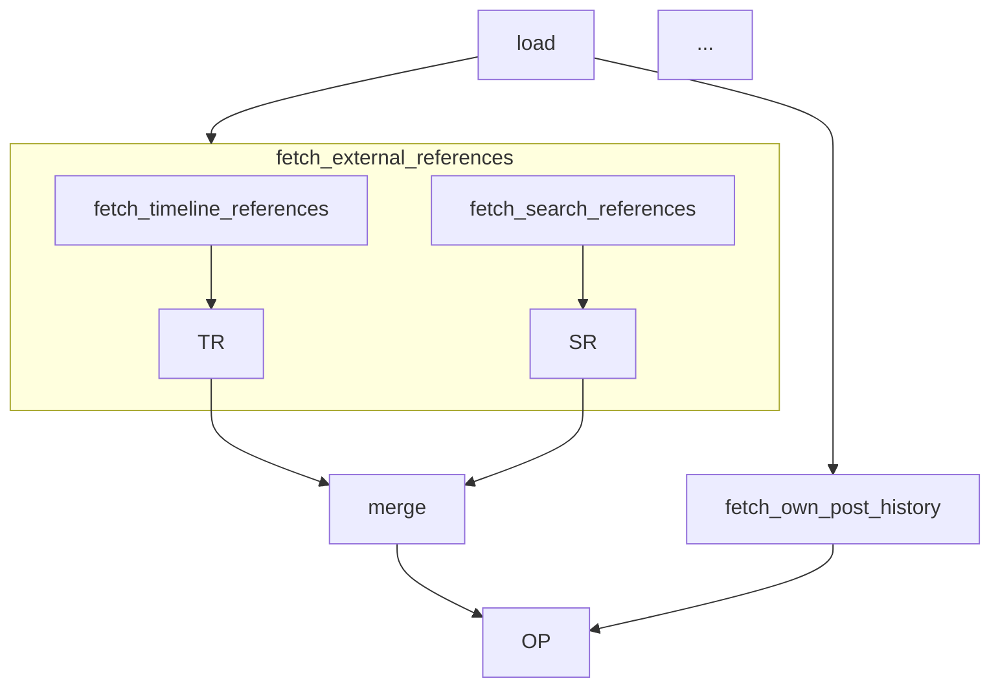

# Task 8: tests-docs

## Section 1 – Task Overview

### Goal

Update unit tests for the typed runbook refactor, add **contract / flow / context** test modules, and refresh **`docs/subsystems/pipeline-runbook.md`** (and briefly `app/pipeline/README.md`) to document artifact catalog, new step graph, and validation policy.

### Gathered context

**Existing runbook test** expects flat tuple step names:

```22:32:SocialMediaAutonomousAgents/backend/tests/unit/test_pipeline_runbook.py
def test_runbook_step_names_are_readable() -> None:
    names = [name for name, _ in POST_TICK_REFERENCE_STEPS]
    assert names == [
        "profile",
        "timeline_pool",
        "search_pool",
        "merge_reference_pools",
        "own_posts_pool",
        "timeline_analysis",
        "own_posts_analysis",
    ]
```

**Merge step test** calls `steps.merge_reference_pools` and uses raw `ctx.set`:

```18:36:SocialMediaAutonomousAgents/backend/tests/unit/test_merge_reference_pools.py
def test_merge_reference_pools_step_updates_timeline_payload() -> None:
    ctx = TickRunContext(account_id="a1", slot="s1")
    ctx.set("timeline_references", {...})
    ctx.set("search_references", {...})
    result = steps.merge_reference_pools(ctx, None)  # type: ignore[arg-type]
```

**Search pool test** references `steps.search_pool`:

```13:18:SocialMediaAutonomousAgents/backend/tests/unit/test_search_pool_step.py
def test_search_pool_skipped_when_disabled() -> None:
    ...
    result = steps.search_pool(ctx, deps)
```

**Subsystem doc** describes flat tuple runbook and old step names:

```128:139:docs/subsystems/pipeline-runbook.md
POST_TICK_REFERENCE_STEPS = (
    ("profile", steps.profile),
    ("timeline_pool", steps.timeline_pool),
    ...
    ("timeline_analysis", timeline.run),
    ("own_posts_analysis", own_posts.run),
)
```

No tests yet for `artifacts.py`, `flow.py`, or `set_artifact`.

### Scope

| Area | Action |
|------|--------|
| `tests/unit/test_pipeline_runbook.py` | Flattened step IDs, mocked end-to-end |
| `tests/unit/test_artifacts.py` | **New** — CONTRACT_FIXTURES validation |
| `tests/unit/test_flow.py` | **New** — flatten_steps, parallel/chain IDs |
| `tests/unit/test_context_artifacts.py` | **New** — set_artifact rejects invalid |
| `tests/unit/test_merge_reference_pools.py` | Rename to `merge_external_references` |
| `tests/unit/test_search_pool_step.py` | Rename to `fetch_search_references` |
| **New** rank/brief step tests | Skip paths (no URLs, insufficient own posts) |
| `docs/subsystems/pipeline-runbook.md` | Artifact catalog, mermaid, validation policy |
| `app/pipeline/README.md` | Pointer to typed runbook |

### Dependencies

All implementation tasks 1–7 complete before tests pass green.

### Locked decisions reflected in docs

- Validate on every `set_artifact`
- Expanded rank+brief step names in runbook
- Context key strings unchanged in artifact catalog table

---

## Section 2 – Proposed Solution

### a. Describe proposed solution

1. Add three new test modules with focused coverage (no redundant trivial asserts).
2. Update existing tests to use `flatten_steps(POST_TICK_REFERENCE_STEPS)` for ID assertions and new step function names.
3. Expand `test_pipeline_runbook` integration mock to assert typed artifacts present after run.
4. Rewrite pipeline-runbook.md sections: package layout (+artifacts.py, flow.py), runbook graph, artifact catalog, validation policy, updated context-key table (same keys, new producers).
5. Note step ID changelog for `pipeline_outcome` traces (`runbook:profile` → `runbook:load_account_bundle`).

### b. Before Panel

**test_pipeline_runbook.py** (representative):

```22:64:SocialMediaAutonomousAgents/backend/tests/unit/test_pipeline_runbook.py
def test_runbook_step_names_are_readable() -> None:
    names = [name for name, _ in POST_TICK_REFERENCE_STEPS]
    assert names == [
        "profile",
        "timeline_pool",
        ...
    ]

def test_runbook_reference_analysis_with_mocked_deps() -> None:
    ...
    result = runbook.reference_analysis("acct1", niche="News", deps=deps)
    assert result.ok
    assert result.ctx.get("timeline_analysis") is not None
```

**pipeline-runbook.md** runbook section — see Section 1 citation (lines 128–139).

**Missing files:** `test_artifacts.py`, `test_flow.py`, `test_context_artifacts.py` — **(new files)**

### c. After Panel

**tests/unit/test_artifacts.py** (new):

```python
"""Contract tests: every artifact model accepts fixture JSON and rejects invalid shapes."""

from __future__ import annotations

import pytest
from pydantic import ValidationError

from app.pipeline.types.artifacts import ARTIFACTS, CONTRACT_FIXTURES, ArtifactKey


@pytest.mark.parametrize("key", list(ArtifactKey))
def test_contract_fixture_validates(key: ArtifactKey) -> None:
    model = ARTIFACTS[key].model
    fixture = CONTRACT_FIXTURES[key]
    validated = model.model_validate(fixture)
    assert validated is not None


def test_account_bundle_requires_account_id() -> None:
    model = ARTIFACTS[ArtifactKey.ACCOUNT_BUNDLE].model
    with pytest.raises(ValidationError):
        model.model_validate({"profile": {}})


def test_artifact_key_roundtrip() -> None:
    for key in ArtifactKey:
        assert ArtifactKey(key.value) == key
```

**tests/unit/test_flow.py** (new):

```python
from app.pipeline.types.artifacts import ArtifactKey
from app.pipeline.types.flow import Step, chain, flatten_steps, parallel
from app.pipeline.types.tool import StepResult


def _noop(_c, _d):
    return StepResult(ok=True)


def test_flatten_steps_dotted_ids() -> None:
    leaf_a = Step(id="a", run=_noop, writes=(ArtifactKey.ACCOUNT_BUNDLE,))
    leaf_b = Step(id="b", run=_noop, reads=(ArtifactKey.ACCOUNT_BUNDLE,))
    root = parallel(chain(leaf_a, leaf_b, id="inner"), id="outer")
    flat = flatten_steps((root,))
    ids = {f.id for f in flat}
    assert ids == {"outer.inner.a", "outer.inner.b"}


def test_chain_preserves_child_order() -> None:
    order: list[str] = []

    def mk(name: str):
        def _run(_c, _d):
            order.append(name)
            return StepResult(ok=True)
        return Step(id=name, run=_run)

    root = chain(mk("rank"), mk("brief"), id="analysis")
    for f in flatten_steps((root,)):
        f.step.run(None, None)  # type: ignore[arg-type]
    assert order == ["rank", "brief"]
```

**tests/unit/test_context_artifacts.py** (new):

```python
import pytest
from app.pipeline.types.artifacts import ArtifactKey
from app.pipeline.types.context import TickRunContext


def test_set_artifact_validates_and_stores_dict() -> None:
    ctx = TickRunContext(account_id="a1", slot="s1")
    ctx.set_artifact(ArtifactKey.ACCOUNT_BUNDLE, {"account_id": "a1", "errors": []})
    raw = ctx.get("account_bundle")
    assert isinstance(raw, dict)
    assert raw["account_id"] == "a1"


def test_set_artifact_rejects_invalid() -> None:
    ctx = TickRunContext(account_id="a1", slot="s1")
    with pytest.raises(ValueError, match="Invalid artifact account_bundle"):
        ctx.set_artifact(ArtifactKey.ACCOUNT_BUNDLE, {"errors": []})  # missing account_id


def test_require_artifact_missing() -> None:
    ctx = TickRunContext(account_id="a1", slot="s1")
    with pytest.raises(KeyError, match="timeline_references"):
        ctx.require_artifact(ArtifactKey.TIMELINE_REFERENCES)
```

**tests/unit/test_pipeline_runbook.py** (updated core test):

```python
from app.pipeline.types.flow import flatten_steps

def test_runbook_flat_step_ids_include_rank_and_brief() -> None:
    flat = flatten_steps(POST_TICK_REFERENCE_STEPS)
    ids = [f.id for f in flat]
    assert ids[-4:] == [
        "summarize_for_compose.external_reference_analysis.rank_external_references",
        "summarize_for_compose.external_reference_analysis.brief_external_references",
        "summarize_for_compose.own_posts_analysis.rank_own_posts",
        "summarize_for_compose.own_posts_analysis.brief_own_posts",
    ]

def test_runbook_reference_analysis_with_mocked_deps() -> None:
    # ... same mock setup ...
    result = runbook.reference_analysis("acct1", niche="News", deps=deps)
    assert result.ok
    assert result.ctx.get("timeline_analysis") is not None
    # Optional: assert last step log entries include reads/writes keys
    assert any(s.get("writes") for s in result.steps)
```

**tests/unit/test_merge_reference_pools.py** — rename function under test:

```python
from app.pipeline.types.artifacts import ArtifactKey

def test_merge_external_references_step_updates_timeline_payload() -> None:
    ctx = TickRunContext(account_id="a1", slot="s1")
    ctx.set_artifact(ArtifactKey.TIMELINE_REFERENCES, {...})
    ctx.set_artifact(ArtifactKey.SEARCH_REFERENCES, {...})
    result = steps.merge_external_references(ctx, None)  # type: ignore[arg-type]
    ...
```

**tests/unit/test_search_pool_step.py** — call `steps.fetch_search_references`.

**New tests/unit/test_rank_brief_steps.py** — skip paths for `rank_external_references` and `rank_own_posts`.

**docs/subsystems/pipeline-runbook.md** — key additions (after panel excerpts):

```markdown
## Typed artifacts

All pipeline context writes use `TickRunContext.set_artifact(ArtifactKey, value)` with Pydantic
validation on every call. Models and registry: `app/pipeline/types/artifacts.py`.

| ArtifactKey | Model | Context key (unchanged) |
|------------|-------|----------------------|
| ACCOUNT_BUNDLE | AccountBundle | account_bundle |
| ... | ... | ... |

## Runbook graph (post-tick reference phase)

File: `runbooks/post_tick.py` — `tuple[Step, ...]` with `parallel()` / `chain()` composites.

Flat leaf order (via `flatten_steps`):
1. load_account_bundle
2. fetch_external_references.fetch_timeline_references
3. fetch_external_references.fetch_search_references
4. merge_external_references
5. fetch_own_post_history
6–9. summarize_for_compose.* (rank + brief × 2)



## Validation policy

- **Writes:** `set_artifact` only inside `app/pipeline/` (tools, steps).
- **Reads:** prefer `get_artifact` / `require_artifact` in steps; interval layer may use `ctx.get`.
- **Raw `ctx.set`:** discouraged; no validation.

## Step ID migration (pipeline outcomes)

| Legacy | New flat ID prefix |
|--------|------------------|
| runbook:profile | runbook:load_account_bundle |
| runbook:timeline_pool | runbook:fetch_external_references.fetch_timeline_references |
| runbook:timeline_analysis | runbook:summarize_for_compose.external_reference_analysis.* |
```

**app/pipeline/README.md** — add bullet:

```markdown
- `types/artifacts.py` — Pydantic artifact models + ARTIFACTS registry
- `types/flow.py` — Step, parallel(), chain(), flatten_steps()
```

### d. Written explanation connecting changes to broader picture

Tests lock in the **non-negotiable contracts**: fixtures prove models match real payloads; context tests prove strict validation; flow tests prove logging IDs stay stable when the runbook tree changes cosmetically. Doc updates make the runbook discoverable for contributors without reading Python—artifact catalog and mermaid replace tribal knowledge. Renaming test functions tracks step renames so CI catches stale references.

---

## Section 3 – Decision Defense

### Chosen path: focused new modules + update existing

| Alternative | Why not chosen |
|-------------|----------------|
| **One mega test file** | Hard to navigate; split by layer matches implementation tasks. |
| **Snapshot entire runbook log** | Brittle; assert key flat IDs and artifact presence instead. |
| **Separate docs file for artifacts** | Fragmentation; extend pipeline-runbook.md as canonical catalog per PROJECT.md map. |

### Parametrize contract fixtures

One test over all `ArtifactKey` members ensures new keys add fixtures in the same PR—prevents registry drift.

### Do not align force-post SSE in this task

`FORCE_POST_STEP_ORDER` in `force_post_progress.py` uses coarse IDs (`fetch_timeline`, `rank_references`)—explicitly out of scope; doc note prevents confusion.

### Frontend

**N/A** for test implementation. Doc mentions dashboard SSE only as related out-of-scope note; no UI interaction sequence required.
