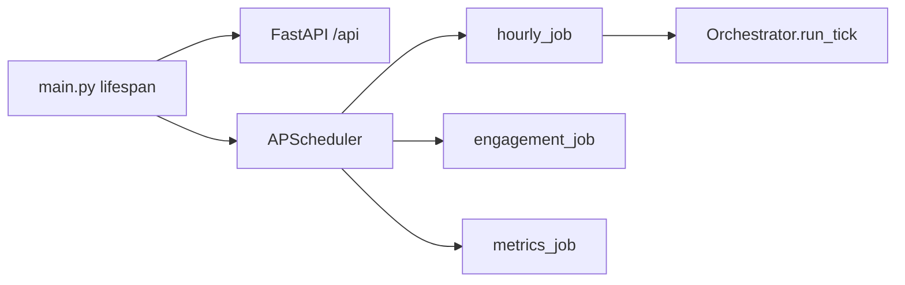

# Entry and runtime

Scope: how the backend process starts, schedules work, and is deployed. Parent: [../PROJECT.md](../PROJECT.md).

## Key paths

| Path | Role |
|------|------|
| `SocialMediaAutonomousAgents/backend/app/main.py` | FastAPI app, lifespan, router registration, APScheduler |
| `SocialMediaAutonomousAgents/backend/app/core/config.py` | Settings from `.env` / environment |
| `SocialMediaAutonomousAgents/backend/app/jobs/hourly_job.py` | Scheduled posting entry |
| `SocialMediaAutonomousAgents/backend/app/jobs/engagement_job.py` | Engagement poll at `:05` each hour |
| `SocialMediaAutonomousAgents/backend/app/jobs/metrics_job.py` | Metrics batch placeholder at `:10` |
| `SocialMediaAutonomousAgents/backend/app/infrastructure/scheduler_lock.py` | Single-process scheduler guard |
| `SocialMediaAutonomousAgents/docker-compose.yml` | Backend + frontend containers |
| `SocialMediaAutonomousAgents/scripts/docker-up.ps1`, `scripts/docker-forced-post.ps1` | Host helpers |

## Process model

One Python process serves **FastAPI** and (when enabled) an in-process **AsyncIOScheduler**:

On startup (`lifespan`):

1. Configures logging from `LOG_LEVEL`
2. If `RUN_SCHEDULER=true`, tries to acquire `sma_apscheduler.lock` (see `scheduler_lock.py`)
3. Builds scheduler with timezone `SCHEDULER_TIMEZONE` (fallback UTC)
4. Registers jobs; shuts down and releases lock on exit

Only **one** process should hold the scheduler lock. Set `RUN_SCHEDULER=false` on extra uvicorn workers. Do not run Docker backend and a local `uvicorn` on the same port — duplicate schedulers cause duplicate posts.

## Scheduled jobs

| Job ID | Trigger | Handler | Notes |
|--------|---------|---------|-------|
| `scheduled_posting` | Cron on minute marks every `POST_INTERVAL_MINUTES` (if &lt; 60), else interval | `run_hourly_job` | Skipped when `HOURLY_POSTING_ENABLED=false` or during [quiet hours](hourly-orchestration.md#quiet-hours) |
| `engagement_poll` | `:05` each hour | `run_engagement_job` | See [engagement-and-metrics](engagement-and-metrics.md) |
| `metrics_batch` | `:10` each hour | `run_metrics_job` | Placeholder only |

Posting mode comes from `SCHEDULER_POST_MODE` (`scheduled` vs `force`) and `SCHEDULER_BYPASS_COOLDOWN`. See [hourly-orchestration](hourly-orchestration.md).

## Docker Compose

`SocialMediaAutonomousAgents/docker-compose.yml`:

- **backend** — port 8000, `env_file: backend/.env`, RavenDB via `host.docker.internal`, certs volume, scheduler env overrides
- **frontend** — port 3000, `REACT_APP_API_URL=http://localhost:8000`

RavenDB runs **separately** (not in this compose file). Start RavenDB first, then `docker compose up -d --build`. See [operations](operations.md).

## Related docs

- Tick pipeline: [hourly-orchestration](hourly-orchestration.md)
- HTTP surface: [api-and-dashboard](api-and-dashboard.md)
- Account provisioning: [ACCOUNT_SETUP](../../SocialMediaAutonomousAgents/backend/docs/ACCOUNT_SETUP.md)
