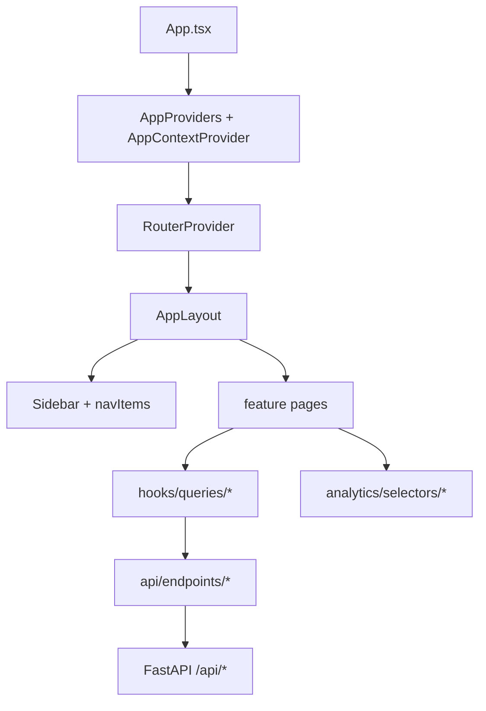

# Frontend dashboard

Scope: React operator UI (analytics dashboard) and its coupling to the FastAPI backend. Parent: [../PROJECT.md](../PROJECT.md).

## Key paths

| Path | Role |
|------|------|
| `SocialMediaAutonomousAgents/frontend/src/App.tsx` | Shell: providers, update modal, toast, `RouterProvider` |
| `SocialMediaAutonomousAgents/frontend/src/app/routes.tsx` | React Router route table |
| `SocialMediaAutonomousAgents/frontend/src/app/AppLayout.tsx` | Sidebar + main content outlet |
| `SocialMediaAutonomousAgents/frontend/src/app/AppContextProvider.tsx` | Shared UI state (`apiBase`, update modal, toast) |
| `SocialMediaAutonomousAgents/frontend/src/app/AppProviders.tsx` | React Query client |
| `SocialMediaAutonomousAgents/frontend/src/analytics/` | Selectors, normalizers, derived metrics (no network I/O) |
| `SocialMediaAutonomousAgents/frontend/src/api/` | `client.ts` + per-domain endpoint modules |
| `SocialMediaAutonomousAgents/frontend/src/hooks/queries/` | TanStack Query hooks per resource |
| `SocialMediaAutonomousAgents/frontend/src/features/` | Route-level page components |
| `SocialMediaAutonomousAgents/frontend/src/navigation/navItems.ts` | Fleet sidebar + per-account sub-nav segments |
| `SocialMediaAutonomousAgents/frontend/package.json` | Dependencies (`react-router-dom`, `@tanstack/react-query`, `recharts`) |

## Structure

Create React App with **client-side routing** (`react-router-dom` v7). Data loads on demand via **TanStack Query** hooks — not a single mount-time bulk fetch.



### Routes

Defined in `app/routes.tsx`:

| Path | Page | Purpose |
|------|------|---------|
| `/` | `FleetOverviewPage` | Fleet KPIs, leaderboard, ops alerts, force post |
| `/accounts/:accountId` | `AccountHqPage` | Account HQ summary |
| `/accounts/:accountId/posts` | `PostsExplorerPage` | Tracked posts table + filters |
| `/accounts/:accountId/posts/:tweetId` | `PostDetailPage` | Post detail + engagement curve |
| `/accounts/:accountId/references` | `ReferencesLabPage` | Pulled reference tweets |
| `/accounts/:accountId/pipeline` | `PipelineOpsPage` | Pipeline outcomes for account |
| `/accounts/:accountId/voice` | `VoiceExperimentsPage` | Voice revisions |
| `/accounts/:accountId/settings` | `AccountSettingsPage` | OAuth status, account settings |

Per-account sub-navigation segments: `navigation/navItems.ts` (`ACCOUNT_SUB_NAV`).

### Feature layout

| Directory | Contents |
|-----------|----------|
| `features/fleet/` | Fleet overview, KPI tiles, leaderboard |
| `features/account/` | Account layout shell, HQ, settings |
| `features/posts/` | Posts explorer, detail, engagement charts |
| `features/pipeline/` | Pipeline ops, skip-reason charts |
| `features/references/` | Reference tweet lab |
| `features/voice/` | Voice experiment history |
| `features/operations/` | Force post, OAuth status card |

Shared UI: `components/layout/`, `components/charts/`, `components/data/`, `components/filters/`.

### API layer

| Path | Role |
|------|------|
| `api/client.ts` | `apiFetch`, `apiBaseUrl`, `apiPrefix`, error parsing |
| `api/endpoints/*.ts` | Typed fetchers per backend resource |
| `types/domain/*.ts` | Domain TypeScript types |
| `types.ts` | Re-exports domain types for convenient imports |

## Data fetching

Hooks in `hooks/queries/` wrap React Query with stable keys, e.g.:

- `useAccounts`, `useDashboard` — fleet home
- `useTrackedPosts`, `useTrackedPost`, `usePostSnapshots` — posts analytics
- `usePipelineOutcomes` — runbook / tick outcomes (`phase` filter supports `runbook:*` ids)
- `useAccountMetrics`, `useAccountSnapshots`, `useVoiceRevisions`, `usePulledTweets`, `useOAuthStatus`

Refresh: **Refresh** buttons call `queryClient.invalidateQueries()` (fleet overview and account pages). There is no global polling interval wired to `REACT_APP_POLLING_INTERVAL` yet.

## Force post

`features/operations/ForcePostSection.tsx`:

- Account dropdown (active accounts only)
- `POST /api/accounts/{id}/force-post` with `Accept: text/event-stream`
- Progress mapped via `lib/forcePostSteps.ts`

**Note:** SSE step IDs (`fetch_profile`, `fetch_timeline`, `rank_references`, …) follow `force_post_progress.py` — not yet aligned with dotted [pipeline runbook](pipeline-runbook.md) step ids (`load_account_bundle`, `fetch_external_references.fetch_timeline_references`, etc.).

## Account updates

`UpdateAccountModal` (from fleet/account flows):

- GET `/api/accounts/{id}/edit`
- PATCH `/api/accounts/{id}` (niche, prompts, `search_queries`, credentials, etc.)

## Environment

| Env var | Effect |
|---------|--------|
| `REACT_APP_API_URL` | Backend origin (compose: `http://localhost:8000`) |
| Dev proxy | Empty base → CRA proxies `/api` to `127.0.0.1:8000` |

## Development

```bash
cd SocialMediaAutonomousAgents/frontend
npm install
npm start   # http://localhost:3000
```

Backend must be on port 8000. See [frontend/README](../../SocialMediaAutonomousAgents/frontend/README.md) for CRA commands.

## Related docs

- API routes (including analytics): [api-and-dashboard](api-and-dashboard.md)
- Pipeline step names (runbook): [pipeline-runbook](pipeline-runbook.md)
- Runtime / Docker: [entry-and-runtime](entry-and-runtime.md)
