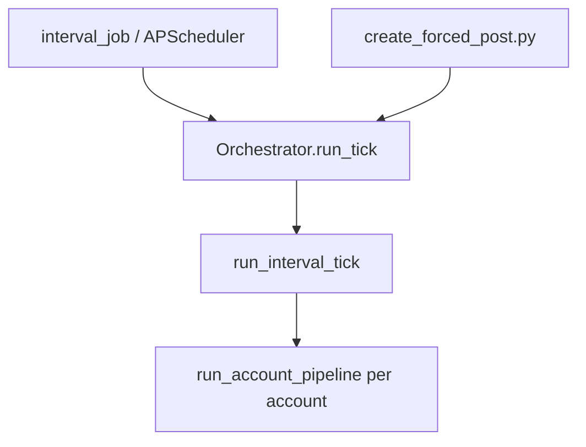

# Interval orchestration

Scope: scheduled and forced posting ticks — gateway from scheduler/CLI to per-account pipeline. Parent: [../PROJECT.md](../PROJECT.md).

## Key paths

| Path | Role |
|------|------|
| `SocialMediaAutonomousAgents/backend/app/agents/orchestrator.py` | Stable entry: `Orchestrator.run_tick()` |
| `SocialMediaAutonomousAgents/backend/app/jobs/interval_job.py` | APScheduler wrapper, quiet-hours gate |
| `SocialMediaAutonomousAgents/backend/app/interval/runner.py` | `run_interval_tick`, `run_account_pipeline` |
| `SocialMediaAutonomousAgents/backend/app/interval/context.py` | `TickContext` shared state |
| `SocialMediaAutonomousAgents/backend/app/interval/schemas.py` | `TickInput`, `TickOutput`, `TickMode` |
| `SocialMediaAutonomousAgents/backend/app/interval/orchestration/pre_tick.py` | Load active accounts |
| `SocialMediaAutonomousAgents/backend/app/interval/orchestration/post_tick.py` | Post to X, update account + registry |
| `SocialMediaAutonomousAgents/backend/app/interval/orchestration/post_guard.py` | Cooldown, file lock, RavenDB post lock |
| `SocialMediaAutonomousAgents/backend/app/interval/orchestration/slot_claim.py` | Slot reservation / revert on failure |
| `SocialMediaAutonomousAgents/backend/app/interval/orchestration/posting_hours.py` | Quiet hours window |
| `SocialMediaAutonomousAgents/backend/app/interval/pipeline_trace.py` | Optional JSON step tracing (`TICK_PIPELINE_TRACE`) |
| `SocialMediaAutonomousAgents/backend/scripts/create_forced_post.py` | Manual force post CLI |
| `SocialMediaAutonomousAgents/backend/app/pipeline/runbook.py` | Reference-analysis runbook entry (`reference_analysis`) |
| `SocialMediaAutonomousAgents/backend/app/api/routes/force_post.py` | HTTP force post + SSE progress |

## Entry points

`Orchestrator.run_tick(mode, account_ids, bypass_post_cooldown)` builds `TickContext` via `build_tick_context` and calls `run_interval_tick`.

| Mode | Behavior |
|------|----------|
| `scheduled` | All `status=active` accounts; slot idempotency enforced |
| `force` | Optional `account_ids`; skips slot idempotency for those accounts |

## Slot key

`current_interval_slot_key()` in `account_repository.py` formats `YYYY-MM-DD-HH-MM` in `SCHEDULER_TIMEZONE`, aligned to `POST_INTERVAL_MINUTES` buckets (not calendar hours).

## Per-account pipeline (summary)

1. **Pre-tick** — reload account; skip inactive; skip if `last_interval_slot == slot` (scheduled); [post guards](#guards)
2. **Data** — profile + tracked metrics bundle ([reference-ingestion](reference-ingestion.md))
3. **Reference phase** — `run_reference_phase` in `interval/reference_phase.py` executes [POST_TICK_REFERENCE_STEPS](pipeline-runbook.md):
   - `load_account_bundle`
   - parallel `fetch_timeline_references` | `fetch_search_references` (search optional when `TREND_TWEET_SEARCH_ENABLED` and account has `search_queries`)
   - `merge_external_references`
   - `fetch_own_post_history`
   - parallel chains: `rank_external_references` → `brief_external_references` | `rank_own_posts` → `brief_own_posts`
   Produces typed context artifacts (`timeline_analysis`, `own_posts_analysis`, `timeline_ranked`, etc.) for compose.
4. **Compose loop** — try ranked refs with `reference_context_block`; [compose-and-safety](compose-and-safety.md) per ref
6. **Post-tick** — `post_tweet`, update account, `TrackedPosts`, copied-reference list

On compose/safety failure for a reference, tries next ranked tweet (up to `MAX_REFERENCE_FALLBACK_ATTEMPTS` when &gt; 0).

## Guards

Applied in order via `try_begin_post` + `try_reserve_interval_slot`:

| Guard | Skip reason examples |
|-------|---------------------|
| Post cooldown | `posted_within_cooldown_Nm` unless `bypass_post_cooldown` |
| Per-account file lock | `account_post_lock_held` |
| RavenDB post lock (`post-locks/{id}`) | `ravendb_post_lock_held` |
| Slot already posted | `already_posted_this_interval` |
| Slot file lock | `slot_lock_held` |

Scheduled mode **writes** `last_interval_slot` early during slot reservation so concurrent ticks skip the same bucket. Failed ticks revert via `release_interval_slot_reservation`.

## Quiet hours

`is_post_quiet_hours()` pauses **scheduler** posting only (default 00:00–08:00 in `SCHEDULER_TIMEZONE`). Manual `create_forced_post.py` is not gated.

## Alternate orchestration helpers (not main path)

`interval/orchestration/safety_filter.py`, `voice_select.py`, and `voice_polish.py` implement generate→rank→polish selection. The **live** timeline pipeline calls `SafetyGuardian.evaluate` directly in `runner.py`, not these helpers.

## Force post entry points

| Entry | Path |
|-------|------|
| CLI | `scripts/create_forced_post.py` → `Orchestrator.run_tick(mode="force")` |
| HTTP | `POST /api/accounts/{id}/force-post` (JSON or SSE with `Accept: text/event-stream`) |
| Dashboard | Fleet overview → Force post ([frontend-dashboard](frontend-dashboard.md)) |

Progress checkpoints are defined in `force_post_progress.py` (coarse ids: `fetch_profile`, `fetch_timeline`, `rank_references`, …). These are **not yet aligned** with dotted runbook step ids logged as `runbook:*` in `PipelineOutcomeRepository` — see [pipeline-runbook](pipeline-runbook.md#force-post-dashboard--api).

## Related docs

- Pipeline tools / runbook: [pipeline-runbook](pipeline-runbook.md)
- Reference fetch/rank: [reference-ingestion](reference-ingestion.md)
- Compose + safety: [compose-and-safety](compose-and-safety.md)
- Persistence updates: [persistence-ravendb](persistence-ravendb.md)
- Scheduler wiring: [entry-and-runtime](entry-and-runtime.md)
