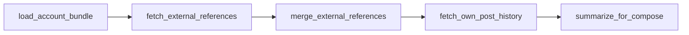

# Pipeline runbook and tools

Scope: the **`app/pipeline`** package — catalog of tools and the **runbook** that orders reference-analysis steps before compose. Parent: [../PROJECT.md](../PROJECT.md).

The runbook is integrated into the live tick via `interval/reference_phase.py`. Complexity stays in services, tools, and step functions.

## Design goals

| Goal | How |
|------|-----|
| Simple imports | `from app.pipeline import tools, runbook` |
| Obvious LLM vs non-LLM | Path: `tools/data/`, `tools/deterministic/`, `tools/llm/` |
| Readable execution order | `runbooks/post_tick.py` — `Step` records with artifact reads/writes |
| Typed context artifacts | `types/artifacts.py` — Pydantic models; all writes via `set_artifact` |
| Hidden wiring | `services/steps.py`, `services/deps.py`, `_runbook_engine.py` |
| Expandable catalog | Register tools in `tools/_bootstrap.py`; add runbook steps |

## Quick start

```python
from app.pipeline import runbook

result = runbook.reference_analysis("JohnJames_News", niche="Broad News")
ctx = result.reference_context()
# ctx["timeline"], ctx["own_posts"], ranked payloads, pattern summaries
```

```python
from app.pipeline import tools

tools.data.timeline_fetch          # data tool (no LLM)
tools.deterministic.reference_rank
tools.llm.reference_pattern_summary  # LLM tool (has prompt_stem)
tools.llm.as_dict()                # all LLM tools by short name
```

## Package layout

```
backend/app/pipeline/
  __init__.py              # exports: tools, runbook, pipeline
  runbook.py               # public: start(), reference_analysis(), steps
  service.py               # PipelineService singleton + registry
  registry.py              # ToolSpec metadata
  accessors.py             # tool_catalog() for internal use (avoids import clash)
  _runbook_engine.py       # step loop (not public)
  types/
    artifacts.py           # ArtifactKey, Pydantic models, ARTIFACTS registry
    flow.py                # Step, parallel(), chain(), flatten_steps()
    context.py             # TickRunContext + get/set_artifact (strict validation)
    tool.py                # StepResult, ToolSpec
  services/
    deps.py                # PostRunDeps.build() — one deps bag per run
    steps.py               # runbook step functions (artifact-centric names)
    reference_analysis.py  # shared rank/brief helpers
  tools/
    data/                  # I/O only — never LLM
    deterministic/         # score, rank, features — never LLM
    llm/                   # every Claude call + PROMPT_STEM
    _bootstrap.py          # registers all tools
    _catalog.py            # tools.data.* / .deterministic.* / .llm.*
  runbooks/
    post_tick.py           # POST_TICK_REFERENCE_STEPS (ordered list)
```

**Note:** The directory `app/pipeline/tools/` (package) holds tool *implementations*. The lazy export `from app.pipeline import tools` resolves to the **ToolCatalog** (namespaces `.data`, `.deterministic`, `.llm`). Internal code uses `tool_catalog()` from `accessors.py` to avoid shadowing the package.

## Tool kinds

| Kind | Directory | LLM? | `TOOL_SOURCE` (optional) | Example |
|------|-----------|------|--------------------------|---------|
| **data** | `tools/data/` | No | `x_timeline`, `ravendb`, `x_api` | `timeline_fetch`, `own_posts_fetch` |
| **deterministic** | `tools/deterministic/` | No | — | `reference_rank`, `reference_score` |
| **llm** | `tools/llm/` | Yes | — | `reference_pattern_summary`, `compose_timeline_post` |

Each tool module exports:

- `TOOL_ID` — e.g. `data.timeline_fetch`
- `TOOL_KIND` — `data` | `deterministic` | `llm`
- `TOOL_PURPOSE` — human-readable
- `PROMPT_STEM` — **llm only** → `interval_crew/prompts/tasks/{stem}.*.md`
- `run(ctx, **kwargs) -> StepResult` — entry for runbook/services
- `TOOL_WRITES` / `OUTPUT_MODEL` — optional artifact metadata (data tools)

### Registered tools (current)

| ID | Short name | Kind |
|----|------------|------|
| `data.account_profile` | `tools.data.account_profile` | data |
| `data.timeline_fetch` | `tools.data.timeline_fetch` | data |
| `data.search_fetch` | `tools.data.search_fetch` | data |
| `data.own_posts_fetch` | `tools.data.own_posts_fetch` | data |
| `deterministic.reference_score` | `tools.deterministic.reference_score` | deterministic |
| `deterministic.reference_rank` | `tools.deterministic.reference_rank` | deterministic |
| `llm.compose_timeline_post` | `tools.llm.compose_timeline_post` | llm |
| `llm.reference_pattern_summary` | `tools.llm.reference_pattern_summary` | llm |

Add a tool: create module under the right folder + one row in `tools/_bootstrap.py`.

## Runbook

The runbook is the **only** place that defines step **order** for the reference-analysis phase.

File: `runbooks/post_tick.py`

Top-level flow (5 blocks; composites expand via `flatten_steps()`):

1. `load_account_bundle` → `account_bundle`
2. `parallel(fetch_timeline_references | fetch_search_references)` — id `fetch_external_references`
3. `merge_external_references` — fan-in `timeline_references` + `search_references` → merged `timeline_references`
4. `fetch_own_post_history` → `own_posts`
5. `parallel(chain(rank_external → brief_external) | chain(rank_own → brief_own))` — id `summarize_for_compose`



Each `Step` declares `reads` / `writes` as `ArtifactKey` values. Logged step ids use dotted paths (e.g. `summarize_for_compose.analyze_external_references.rank_external_references`).

Public API (`runbook.py`):

| Function | Role |
|----------|------|
| `runbook.start(account_id, niche=..., mode=...)` | Create `TickRunContext` |
| `runbook.reference_analysis(account_id, ...)` | Run `POST_TICK_REFERENCE_STEPS` |
| `runbook.steps` | Re-export of `POST_TICK_REFERENCE_STEPS` (flatten via `flatten_steps()` for leaf ids) |

`PostRunDeps.build()` constructs `TickDataService`, repos, and Twitter once per run. Callers do not pass tick_data into the runbook.

Execution engine (`_runbook_engine.run_steps`) accepts `Sequence[Step]`, flattens composites, and logs per-step `ok` / `skipped` / `reads` / `writes`. Not imported by application code outside `pipeline/`.

**Validation:** All pipeline context writes use `ctx.set_artifact(key, value)` which runs Pydantic `model_validate` on every write.

## Relationship to `interval/runner.py`

The **production post tick** flows through `Orchestrator` → `run_account_pipeline` → `run_reference_phase` in `interval/reference_phase.py`, which executes `POST_TICK_REFERENCE_STEPS` before compose and publish.

| Layer | Today |
|-------|--------|
| Guards, slot, publish | `interval/runner.py` |
| Reference analysis runbook | `app/pipeline/runbooks/post_tick.py` (via `reference_phase.py`) |
| Compose (live) | `interval/compose_timeline_post.py` with `reference_context_block` from analysis briefs |

## Prompt ↔ LLM tool mapping

| Prompt stem | LLM tool module |
|-------------|-----------------|
| `compose_timeline_post` | `tools/llm/compose_timeline_post.py` |
| `reference_pattern_summary` | `tools/llm/reference_pattern_summary.py` |

Files live under `backend/app/interval_crew/prompts/tasks/`. LLM tools load them via `prompt_loader` using `PROMPT_STEM`.

## Context artifacts (typed)

Canonical models: `app/pipeline/types/artifacts.py`. Context key strings are unchanged.

| `ArtifactKey` | Pydantic model | Written by |
|---------------|----------------|------------|
| `account_bundle` | `AccountBundle` | `load_account_bundle` |
| `timeline_references` | `TimelineReferencesPayload` | `fetch_timeline_references`, `merge_external_references` |
| `search_references` | `SearchReferencesPayload` | `fetch_search_references` |
| `own_posts` | `OwnPostsPayload` | `fetch_own_post_history` |
| `timeline_ranked` | `RankedReferencesPayload` | `rank_external_references` |
| `timeline_analysis` | `ReferencePatternBrief` | `brief_external_references` |
| `own_posts_ranked` | `RankedReferencesPayload` | `rank_own_posts` |
| `own_posts_analysis` | `ReferencePatternBrief` | `brief_own_posts` |

`RankedReferencesPayload` reuses `GatheredTweet` for ranked rows. `ReferenceTweetRow` uses `extra="allow"` for variable X API fields.

Contract tests: `tests/unit/test_artifacts.py`, `tests/unit/test_context_artifacts.py`.

`RunbookResult.reference_context()` returns a dict suitable for compose injection.

## Force post (dashboard / API)

Manual force post enters via `Orchestrator.run_tick(mode="force")` or `POST /api/accounts/{id}/force-post` (SSE progress). Dashboard progress uses **coarse** step ids in `force_post_progress.py` / `forcePostSteps.ts` (`fetch_profile`, `fetch_timeline`, …) — not yet the dotted runbook ids (`runbook:load_account_bundle`, …) written to `PipelineOutcomeRepository`.

See [api-and-dashboard](api-and-dashboard.md) and [frontend-dashboard](frontend-dashboard.md).

## Adding a new capability

1. **Tool** — implement `run()` under `tools/{data|deterministic|llm}/`, register in `_bootstrap.py`.
2. **Step wrapper** (if deps wiring is non-trivial) — one function in `services/steps.py`.
3. **Runbook** — add a `Step(...)` to `POST_TICK_REFERENCE_STEPS` with declared `reads` / `writes`.
4. **Docs** — update this file and [interval-crew-llm](interval-crew-llm.md) if new prompts.

Do **not** import `_runbook_engine` or `_bootstrap` from outside `app/pipeline/`.

## Related docs

- Live tick gateway: [interval-orchestration](interval-orchestration.md)
- Timeline fetch (underlying data tool): [reference-ingestion](reference-ingestion.md)
- Compose + safety: [compose-and-safety](compose-and-safety.md)
- Prompt inventory: [interval-crew-llm](interval-crew-llm.md)
- TrackedPosts (own-posts pool): [persistence-ravendb](persistence-ravendb.md), [engagement-and-metrics](engagement-and-metrics.md)
