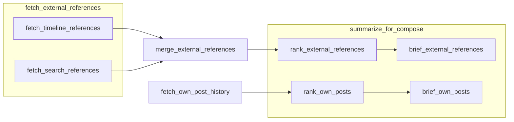
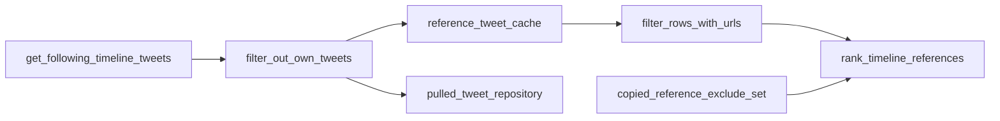

# Reference ingestion

Scope: fetching timeline tweets, ranking, caching, and deduplication for the posting pipeline. Parent: [../PROJECT.md](../PROJECT.md).

## Key paths

| Path | Role |
|------|------|
| `SocialMediaAutonomousAgents/backend/app/services/tick_data_service.py` | `compile_timeline_reference_tweets`, account bundle |
| `SocialMediaAutonomousAgents/backend/app/services/reference_tweet_cache.py` | In-memory cache per account/slot |
| `SocialMediaAutonomousAgents/backend/app/interval/tweet_topic_preanalysis.py` | Rank, preanalysis, skip reasons |
| `SocialMediaAutonomousAgents/backend/app/services/copied_references.py` | Exclude already-reposted source ids |
| `SocialMediaAutonomousAgents/backend/app/services/pulled_tweet_repository.py` | Persist pulled rows |
| `SocialMediaAutonomousAgents/backend/app/pipeline/tools/data/timeline_fetch.py` | Pipeline data tool wrapping `TickDataService` |
| `SocialMediaAutonomousAgents/backend/app/pipeline/tools/data/own_posts_fetch.py` | Own-post history from `TrackedPosts` |
| `SocialMediaAutonomousAgents/backend/app/pipeline/tools/deterministic/reference_rank.py` | Shared top-N ranking |
| `SocialMediaAutonomousAgents/backend/app/social/tweet_enrichment.py` | `filter_rows_with_urls`, media URL selection |

## Flow (live tick)

Reference data enters the tick through the [pipeline runbook](pipeline-runbook.md) (`reference_phase.py` → `POST_TICK_REFERENCE_STEPS`). Underlying I/O still flows through `TickDataService` and X APIs:

After the runbook, `runner.py` picks a compose winner from `timeline_ranked`, applies URL filtering and copied-reference exclusions, and runs [compose-and-safety](compose-and-safety.md).

## Timeline fetch

When `FOLLOWING_FEED_ENABLED=true` (default):

- Up to `FOLLOWING_TIMELINE_MAX_RESULTS` tweets (default 100) from the authenticated user's **following home timeline**
- Own tweets removed via `filter_out_own_tweets`
- **TrackedPosts are not** used as reference candidates

Results cached in memory keyed by `(account_id, slot)` for `REFERENCE_TWEET_CACHE_MINUTES` (default 45).

Each fetch records rows in **PulledTweets** with new/duplicate stats on the payload (`pulled_tweet_stats`).

## URL requirement

`filter_rows_with_urls` keeps only rows with embeddable/linkable media URLs. If the pool is empty after filtering and exclusions:

| Skip reason | Meaning |
|-------------|---------|
| `no_reference_with_urls` | No URL-bearing timeline tweets to compose from |

Tick ends without LLM compose or post.

## Ranking

`rank_timeline_references` scores by weighted engagement:

- likes × 0.7, replies × 0.6, retweets × 1.0, impressions × 0.1

Excludes ids in `copied_reference_tweet_ids` on the account document.

`MAX_REFERENCE_FALLBACK_ATTEMPTS` (default 0 = try full ranked list) can cap how many sources are attempted per tick.

## Copied references

After a successful post, `record_copied_reference` appends the source tweet id so it is not reused. Stored on the account document (not a separate collection).

## X recent search (disabled by default)

When `TREND_TWEET_SEARCH_ENABLED=true` and the account has `search_queries` (list of raw X query strings), the runbook step **`fetch_search_references`** calls `data.search_fetch` → `TickDataService.compile_search_reference_tweets`. Results merge with the timeline pool in **`merge_external_references`** before rank/analysis.

Per-query failures (e.g. 402) append to `reference_errors` and do not abort the runbook. Search rows are tagged `source=search_recent` with `search_query` provenance.

Configure queries via account PATCH (`search_queries`) or RavenDB directly. Niche discourse/trends (`compile_niche_discourse`) remain separate optional context.

## Own-post references (pipeline)

The live tick uses **external** timeline (+ optional search) tweets as compose sources. The runbook also loads **own** posts from `TrackedPosts` for voice/performance analysis:

- **`fetch_own_post_history`** → `tools.data.own_posts_fetch` — RavenDB rows via `TrackedPostRepository.list_for_account()`
- **`rank_own_posts`** → `tools.deterministic.reference_rank` (top 10 by `popularity_score` weights)
- **`brief_own_posts`** → `tools.llm.reference_pattern_summary` with `source=own_posts`
- Skips when fewer than 3 tracked posts (does not block posting)

Own-post text may come from `raw_metrics.text` until `post_text` is stored on `TrackedPostDocument` at publish time.

See [pipeline-runbook](pipeline-runbook.md).

## Related docs

- Pipeline catalog: [pipeline-runbook](pipeline-runbook.md)
- X timeline API: [social-x-integration](social-x-integration.md)
- Compose from winner: [compose-and-safety](compose-and-safety.md)
- Orchestration loop: [interval-orchestration](interval-orchestration.md)
- Storage: [persistence-ravendb](persistence-ravendb.md)
