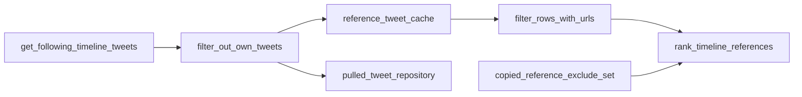

# Reference ingestion

Scope: fetching timeline tweets, ranking, caching, and deduplication for the posting pipeline. Parent: [../PROJECT.md](../PROJECT.md).

## Key paths

| Path | Role |
|------|------|
| `SocialMediaAutonomousAgents/backend/app/services/tick_data_service.py` | `compile_timeline_reference_tweets`, account bundle |
| `SocialMediaAutonomousAgents/backend/app/services/reference_tweet_cache.py` | In-memory cache per account/slot |
| `SocialMediaAutonomousAgents/backend/app/interval/tweet_topic_preanalysis.py` | Rank, preanalysis, skip reasons |
| `SocialMediaAutonomousAgents/backend/app/services/copied_references.py` | Exclude already-reposted source ids |
| `SocialMediaAutonomousAgents/backend/app/services/pulled_tweet_repository.py` | Persist pulled rows |
| `SocialMediaAutonomousAgents/backend/app/interval_crew/tools/tick_data.py` | Thin wrappers used by `interval/runner.py` |
| `SocialMediaAutonomousAgents/backend/app/social/tweet_enrichment.py` | `filter_rows_with_urls`, media URL selection |

## Flow

## Timeline fetch

When `FOLLOWING_FEED_ENABLED=true` (default):

- Up to `FOLLOWING_TIMELINE_MAX_RESULTS` tweets (default 100) from the authenticated user's **following home timeline**
- Own tweets removed via `filter_out_own_tweets`
- **TrackedPosts are not** used as reference candidates

Results cached in memory keyed by `(account_id, slot)` for `REFERENCE_TWEET_CACHE_MINUTES` (default 45).

Each fetch records rows in **PulledTweets** with new/duplicate stats on the payload (`pulled_tweet_stats`).

## URL requirement

`filter_rows_with_urls` keeps only rows with embeddable/linkable media URLs. If the pool is empty after filtering and exclusions:

| Skip reason | Meaning |
|-------------|---------|
| `no_reference_with_urls` | No URL-bearing timeline tweets to compose from |

Tick ends without LLM compose or post.

## Ranking

`rank_timeline_references` scores by weighted engagement:

- likes × 0.7, replies × 0.6, retweets × 1.0, impressions × 0.1

Excludes ids in `copied_reference_tweet_ids` on the account document.

`MAX_REFERENCE_FALLBACK_ATTEMPTS` (default 0 = try full ranked list) can cap how many sources are attempted per tick.

## Copied references

After a successful post, `record_copied_reference` appends the source tweet id so it is not reused. Stored on the account document (not a separate collection).

## Trend search (disabled by default)

`TREND_TWEET_SEARCH_ENABLED=false` — search stream exists in `TickDataService` / X client but is **not** the live reference source. Niche discourse/trends may still be compiled for optional context in alternate pipelines.

## Related docs

- X timeline API: [social-x-integration](social-x-integration.md)
- Compose from winner: [compose-and-safety](compose-and-safety.md)
- Orchestration loop: [interval-orchestration](interval-orchestration.md)
- Storage: [persistence-ravendb](persistence-ravendb.md)
